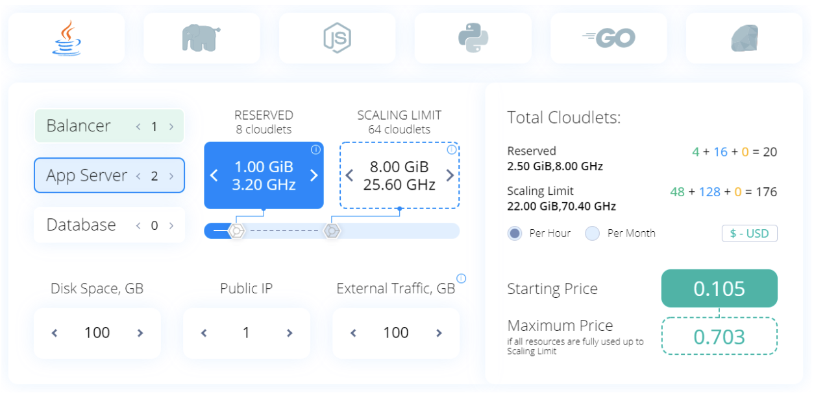

# Jelastic Pricing Calculator Widget

[Jelastic Pricing Calculator](https://jelastic.com/pay-per-use/#cloud-pricing-calculator) widget is an interactive tool that estimates the environment cost based on the configured topology. It is based on the standard HTML, js, and CSS technologies supported by all modern browsers, which ensures easy installation on any page without any additional requirements. Also, the initialization is performed in the background and does not affect the page loading speed.

Widget addition to your site can be accomplished in a few simple steps:

1. All the required scripts and styles for the pricing calculator widget are stored in the dedicated `j-calculator` directory. You can get this folder from the appropriate [repository](https://github.com/jelastic/jelastic-calculator-widget). For example, with the following command:

    ```html
    git clone https://github.com/jelastic/jelastic-calculator-widget.git
    ```
    
    `Tip: If you want to customize the widget appearance, refer to the linked section and adjust files within the directory up to your needs.`

2. Add the `j-calculator` folder downloaded in the previous step to your site's root folder and insert the following lines between the `<head>` and `</body>` tags of the required page:

    ```html
    <script src="{siteUrl}/j-calculator/3dparty/ejs.js"></script>
    <script src="{siteUrl}/j-calculator/j-calculator.min.js"></script>
    <link rel="stylesheet" href="{siteUrl}/j-calculator/j-calculator.min.css">
    ```
    Don’t forget to correctly substitute your ***{siteUrl}*** placeholder.

3. Now, insert the following block at the position the widget should be displayed at:

    ```html
    <div class="j-calculator" data-key="app.{hoster_domain}"></div>
    ```
    
    `
    IMPORTANT: The data-key parameter allows displaying pricing for your specific platform only. If skipped, a platform selector list will be displayed.
    `
    
The default ready-to-work pricing calculator widget looks as follows:



If needed, you can adjust the widget by tuning predefined ranges and values or customize the whole widget by adjusting its source code.

###Customize Widget Parameters

The widget is provided with multiple out-of-box arguments that allow you to customize resource ranges and the default values (i.e. the state of parameters right after the widget is loaded) up to your needs.

Parameter | Description | Example Value
------------ | ------------- | -------------
data-languages | A comma-separated string of the programming languages displayed within the widget. | java, php, node, python, go, ruby
data-key | Define this parameter to show prices for the particular hosting provider only. Otherwise, a platform selector list will be displayed. | app.{[hoster_domain](https://docs.jelastic.com/jelastic-hoster-info)}
data-storage | The default amount of storage space for the environment in GB (in the 0-99999 range). 10 if not specified. | {number}
data-ip | The default number of external IP addresses for the environment  (in the 0-10 range). 1 if not specified. | {number}
data-traffic | The default amount of external traffic for the environment per month in GB (in the 0-99999 range). 10 if not specified. | {number}
data-balancer-nodes | The number of the load balancer nodes enabled by default (in the 0-99 range). 0 if not specified. | {number}
data-balancer-min | The minimum cloudlets consumption per load balancer. 0 if not specified. | {number}
data-balancer-max | The maximum cloudlets consumption per load balancer. 128 if not specified. | {number}
data-balancer-reserved | The default number of fixed (reserved) cloudlets per load balancer. 0 if not specified. | {number}
data-balancer-scaling | The default number of flexible (dynamic) cloudlets per load balancer. 0 if not specified. | {number}
 data-appserver-nodes | The number of application servers enabled by default (in the 0-99 range). 1 if not specified. | {number}
data-appserver-min | The minimum cloudlets consumption per application server. 0 if not specified. | {number}
data-appserver-max | The maximum cloudlets consumption per application server. 128 if not specified. | {number}
data-appserver-reserved | The default number of fixed (reserved) cloudlets per application server. 1 if not specified. | {number}
data-appserver-scaling | The default number of flexible (dynamic) cloudlets per application server. 64 if not specified. | {number}
data-database-nodes | The number of the database nodes enabled by default (in the 0-99 range). 0 if not specified. | {number}
data-database-min | The minimum cloudlets consumption per database. 0 if not specified. | {number}
data-database-max | The maximum cloudlets consumption per database. 128 if not specified. | {number}
data-database-reserved | The default number of fixed (reserved) cloudlets per database. 0 if not specified. | {number}
data-database-scaling | The default number of flexible (dynamic) cloudlets per database. 0 if not specified. | {number}
data-period | The default period (hourly/monthly) for the price estimation. Hourly if not specified. | hourly/monthly
data-currencies | A comma-separated list of the currencies that can be selected in the widget. All currencies are displayed if the parameter is not specified. | USD,EUR,INR
data-start-currency	 | A code of the currency that should be displayed by default. USD if not specified. | USD / INR / EUR / etc.

These properties can be provided in the following way:

```html
    <div class="j-calculator"
        data-languages="php, node"
        data-key="app.{hoster_domain}"
        data-storage="25"
        data-ip="2"
        data-traffic="25"
        data-balancer-nodes="0"
        data-balancer-min="10"
        data-balancer-max="512"
        data-balancer-reserved="80"
        data-balancer-scaling="256"
        data-appserver-nodes="1"
        data-appserver-min="10"
        data-appserver-max="256"
        data-appserver-reserved="50"
        data-appserver-scaling="200"
        data-database-nodes="0"
        data-database-min="128"
        data-database-max="256"
        data-database-reserved="200"
        data-database-scaling="210"
        data-period="monthly"
        data-currencies="USD,EUR"
        data-start-currency="EUR"
    ></div>
```


### Customize Widget Layout

If needed, the widget can be fully customized to match your particular needs and brand look. The project is built based on the **Gulp** with [SCSS](https://sass-lang.com/) preprocessor, which provides access to the following features:

- CSS auto-prefixing
- built-in preview server with BrowserSync
- compile sass with libsass
- lint and minify scripts
- image optimization

In order to perform customization to the project, you’ll need a [Node.js](https://nodejs.org/) server of 6 or higher version.

1. Install the [Gulp](https://gulpjs.com/) utility with the following command:

    ```
    npm install gulp --global
    ```

2. Next, clone the widget repository.

    ```
    git clone https://github.com/jelastic/jelastic-calculator-widget.git
    ```
    
3. Move inside the project folder and install dependencies.

    ```
    cd j-calculator
    npm install -d   
    ```
    
4. Start a server with gulp to preview changes.

    ```
    gulp serve
    ```
    
5. You can change CSS in the __assets/scss/*.scss__ file. For example, the default variables:

    ```
    $laptop: 1366px; // default media query sizes
    $tablet: 1024px;
    $mobile: 768px;
    $extraSmall: 475px;
    $mainColor: #0087ff; // default color (Application Server)
    $dbColor: #ffb000; // default orange color (Database)
    $balancerColor: #09b475; // default blue color (Load Balancer)
    ```
    
6. Once you are satisfied with the results, build the production environments.

    ```
    gulp default
    ```
    
    In a moment, you will have the following files in the j-calculator folder:
    
    - __index.html__ - example with widget initialization selector
    - __j-calculator.min.js__ - minified JavaScript
    - __j-calculator.min.css__ - minified CSS
    
    Use these files instead of the default ones during the widget addition to your website page.
    
7. Additionally, for the best performance, some images are saved in the SVG format, optimized with the [svgomg](https://jakearchibald.github.io/svgomg/) service and included in CSS/SCSS with the BASE64 technology via [base64encode.org](https://www.base64encode.org/). Non-converted images can be located in the __assets/img/__ folder.

Now, you have all the required information to customize (if needed) and integrate the Jelastic Pricing Calculator widget to your website.